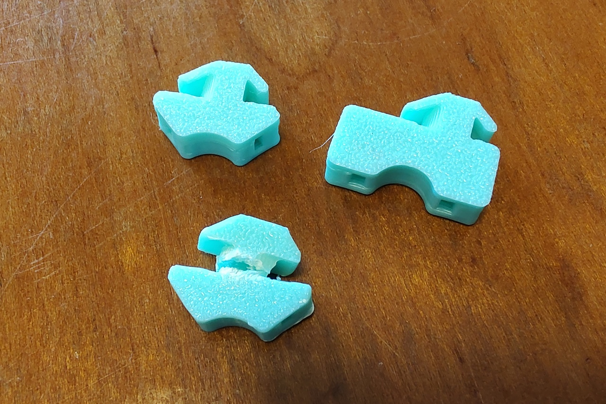

# snapin_anchor
Cable tie anchor for MISUMI extruded frames

## What is this?
The voron cable_frame_anchor_x6.stl and deck_support_3mm_x8.stl are a little too large for the MISUMI extruded frame and are difficult to install.
As you can see in the picture, if you try to force it to attach it, it will break.

As a countermeasure, I designed a part with a head that matches the size to the Misumi extruded frame and gives it spring characteristics.
This part can be easily installed.

